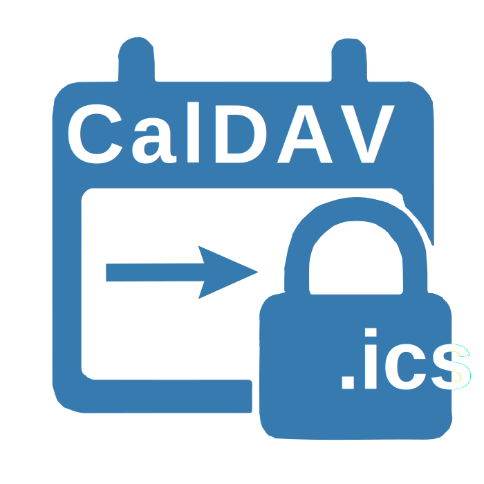

# caldav2ics

Convertisseur CalDAV → ICS sécurisé et sans stockage, déployé sur
[Deno Deploy](https://deno.com/deploy)



## 🚀 À propos

**caldav2ics** permet de générer à la volée un flux `.ics` lisible par Google
Calendar, Outlook ou Apple Calendar, à partir d’un calendrier CalDAV protégé par
identifiants.

Aucune donnée n'est stockée : l’URL CalDAV est chiffrée et intégrée dans un slug
lisible publiquement.

---

## ✨ Fonctionnalités

- 🔐 100% stateless : pas de base de données, ni de stockage serveur
- 🔁 Génération dynamique d’un fichier `.ics` à la demande
- 🔗 Lien ICS compatible Google / Outlook / Apple
- ⚙️ Compatible avec tous les serveurs CalDAV (Nextcloud, Zimbra, Baïkal…)
- 🧩 Formulaire de découverte automatique des calendriers disponibles
- 🎨 Interface légère (Fresh + Tailwind CSS)
- 🗂️ Slug chiffré dans l’URL : `http://localhost:8000/<slug>.ics`

---

## 🧪 Exemple

> `http://localhost:8000/u4BdpxTSKZWhEZgU1rDyb7O2iqcWF-ZZFnE0ugHvm2c.ics`

Ce lien est :

- dérivé de l'URL CalDAV (avec login + mot de passe)
- compressé, chiffré, encodé
- décodé à chaque appel sans stocker l’identifiant

---

## 🔧 Installation locale

```bash
deno task dev
# ou
deno run -A main.ts
```

---

## 🔐 Chiffrement des slugs

Les identifiants CalDAV sont :

1. concaténés à l’URL
2. compressés avec GZIP (via WebAssembly)
3. chiffrés avec AES-GCM (clé dérivée via PBKDF2 + salt)
4. encodés en base64url

Le slug est ensuite directement inclus dans l’URL.

---

## 🐙 Liens utiles

- 🔗 [RFC 5545 - ICS Format](https://datatracker.ietf.org/doc/html/rfc5545)
- 🔐
  [MDN crypto.subtle](https://developer.mozilla.org/fr/docs/Web/API/SubtleCrypto)
- 📅 [Fresh (Deno Web Framework)](https://fresh.deno.dev)

---

## 📝 Licence

MIT — open source et librement auto-hébergeable ✨
